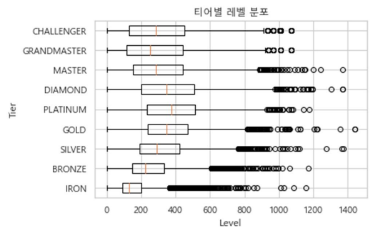

# [리그오브레전드 데이터 분석 및 승패 예측 모델 개발]
---
## 목차
[1. 프로젝트 개요](#1-분석-개요) 
[2. 데이터 수집](#3-데이터-수집) 
[3. 데이터 전처리](#4-데이터-전처리) 
[4. 데이터 시각화](#5-데이터-시각화) 
[5. 승패 예측 모델 개발](#6-승패-예측-모델-개발) 

## 1. 프로젝트 개요
* 프로젝트 기간  
    2023.03 ~ 2023.06 (4개월)

* 목적  
    게임의 승패에 영향을 미치는 요인에 대해 알아보고, 실제 게임 플레이 전략 수립에 활용 

* 차별점
    - 일반 플레이어들의 데이터를 활용하여 실제 적용 가능한 모델 생성
    - 두 가지의 관점으로 모델링: 팀 단위/개인 단위
    

## 2. 데이터 수집
* 데이터 수집 
    + 수집 범위
        - 게임 범위: 리그 오브 레전드 한국 서버, 5*5 랭크 게임
        - 티어 범위: 아이언 ~ 플래티넘(5개의 티어)
        - 데이터 범위: 티어별 25000 게임(총 125000 게임) 
            <데이터 수집 범위 결정 과정> 
                티어별 총 게임 수 상위 5000명의 계정 레벨 시각화로 수집 범위 결정
                 
                - 아이언 ~ 플래티넘 티어: 티어와 사용자 레벨의 중앙값이 비례하여 상승 
                - 다이아 ~ 챌린저 티어: 위의 경향을 따르지 않음

    + 데이터 수집 방법: Riot API를 통한 수집 
        4개의 API를 거쳐(호출한 결과를 다음 순서의 API 입력으로 사용) 게임 데이터 수집  
        
        - API 링크: [Riot API](https://developer.riotgames.com/apis)
        - 데이터 수집 과정
            - [데이터 수집: 플레이어 데이터](https://github.com/yeji4268/BigData/blob/main/%EB%A6%AC%EA%B7%B8%EC%98%A4%EB%B8%8C%EB%A0%88%EC%A0%84%EB%93%9C%20%EB%B6%84%EC%84%9D/Data%20Collection/Data%20Collection_Summoner.ipynb)
            - [데이터 수집: 게임 데이터](https://github.com/yeji4268/BigData/blob/main/%EB%A6%AC%EA%B7%B8%EC%98%A4%EB%B8%8C%EB%A0%88%EC%A0%84%EB%93%9C%20%EB%B6%84%EC%84%9D/Data%20Collection/Data%20Collection_Game%20Data.ipynb)

## 3. 데이터 전처리
* 데이터 전처리
    + 플레이어(계정) 데이터
        - 결측치 처리: 결측치가 있는 행 삭제 
        - 파생변수 생성: 전체 게임 수(승리한 게임 수 + 패배한 게임 수)
        - 상위 5000명 추출(정렬 기준: 전체 게임 수)
    + 인게임 데이터: 결측치 처리 - 결측치가 있는 행 삭제
        - 인게임 데이터: 팀
            - 게임 단위 데이터 분할: 게임 단위(1건) --> 팀 단위(2건)으로 분할
            - 오브젝트 관련 파생변수 생성: baron, dragon, inhibitor, herald, tower
            - 팀 지표 관련 파생변수 생성: 전체 처치 수, 전체 죽음 횟수, 전체 가한 데미지, 전체 미니언 처치 수
        - 인게임 데이터: 게임 단위 데이터 분할 - 게임 단위(1건) --> 개인 단위(10건)으로 분할
    + [데이터 전처리](https://github.com/yeji4268/BigData/tree/main/%EB%A6%AC%EA%B7%B8%EC%98%A4%EB%B8%8C%EB%A0%88%EC%A0%84%EB%93%9C%20%EB%B6%84%EC%84%9D/Data%20Preprocessing)

## 4. 데이터 시각화
* interactive plot: ipywidgets 사용으로 UI 포함 plot
    - [데이터 시각화: interactive plot](https://github.com/yeji4268/BigData/tree/main/%EB%A6%AC%EA%B7%B8%EC%98%A4%EB%B8%8C%EB%A0%88%EC%A0%84%EB%93%9C%20%EB%B6%84%EC%84%9D/Data%20Visualization)
* 데이터 시각화: R ggplot 패키지를 사용한 시각화
    - [데이터 시각화](https://github.com/yeji4268/BigData/blob/main/%EB%A6%AC%EA%B7%B8%EC%98%A4%EB%B8%8C%EB%A0%88%EC%A0%84%EB%93%9C%20%EB%B6%84%EC%84%9D/Data%20Visualization/Data%20Visualization.Rmd)

## 5. 승패 예측 모델 개발 
* 데이터 구성
    - 개인 데이터: 14개의 변수 + 1개의 타겟 변수(0: 패배, 1: 승리)
    - 팀 데이터: 15개의 변수 + 1개의 타겟 변수(0: 패배, 1: 승리)
* 성능 평가 기준: 정확도(Accuracy), F1-Score
* [승패 예측 모델 개발](https://github.com/yeji4268/BigData/blob/main/%EB%A6%AC%EA%B7%B8%EC%98%A4%EB%B8%8C%EB%A0%88%EC%A0%84%EB%93%9C%20%EB%B6%84%EC%84%9D/Modeling/Modeling%26Factor%20Analysis.ipynb)

